# Trapp Tracker - User Flows

**Version:** 1.0  
**Last Updated:** March 15, 2026  
**Platform:** React Native + Expo (iOS, Android, Web)

---

## Document Overview

This document details the complete user flows for Trapp Tracker, covering all primary user journeys from onboarding through core feature usage. Each flow includes:

- **Flow Diagram:** Visual representation of the user journey
- **Step Descriptions:** Detailed explanation of each step
- **Decision Points:** Branching logic and conditions
- **Error Paths:** Alternative flows for error scenarios
- **Success Criteria:** Expected outcomes

---

## Flow Legend

```
┌─────────────┐
│   Screen    │  Rectangle = Screen/View
└─────────────┘

     ▼          Arrow = Navigation/Flow direction

    ◇ ◇ ◇ ◇     Diamond = Decision point

    ( O )       Circle = Start/End point

    [Action]    Brackets = User action

   {System}     Braces = System process

    ─ ─ ─ ─      Dashed = Optional/Alternative path
```

---

## Flow 1: Onboarding & Authentication

### 1.1 First-Time User Flow

**Goal:** Guide new users from app download to first workout log  
**Entry Point:** App launch (first time)  
**Exit Point:** Home screen with first workout logged

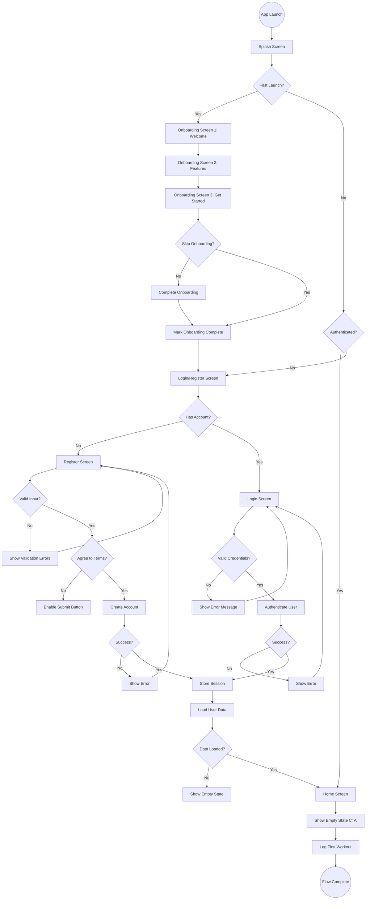

### 1.2 Returning User Flow

**Goal:** Authenticate returning users quickly  
**Entry Point:** App launch  
**Exit Point:** Home screen

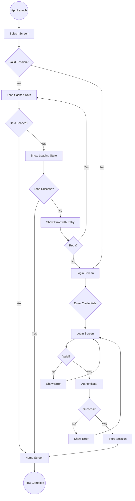

### 1.3 Session Recovery Flow

**Goal:** Handle expired sessions gracefully  
**Entry Point:** Any authenticated screen  
**Exit Point:** Login screen or recovered session

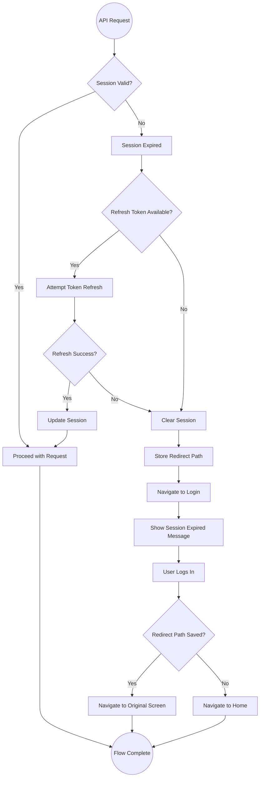

---

## Flow 2: Workout Logging (Critical Path)

### 2.1 Quick Log Flow (<10 seconds)

**Goal:** Log a workout in under 10 seconds  
**Entry Point:** Home screen  
**Exit Point:** Success confirmation  
**Target:** Maximum 3-4 taps

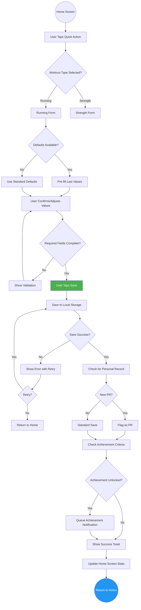

**Step-by-Step Timing Analysis:**

| Step      | Action                     | Target Time     |
| --------- | -------------------------- | --------------- |
| 1         | Tap Quick Action button    | 0.5s            |
| 2         | Form appears with defaults | 0.2s            |
| 3         | Review/adjust values       | 3-5s            |
| 4         | Tap Save button            | 0.5s            |
| 5         | Save confirmation          | 0.3s            |
| **Total** |                            | **<10 seconds** |

### 2.2 Full Workout Log Flow

**Goal:** Log a detailed workout with all options  
**Entry Point:** Home screen or Calendar  
**Exit Point:** Success confirmation

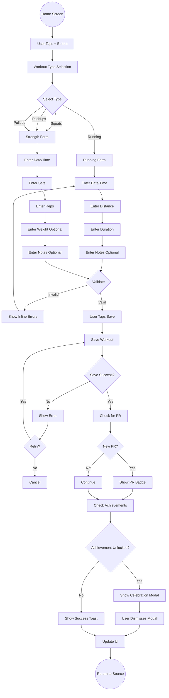

### 2.3 Edit Workout Flow

**Goal:** Modify an existing workout  
**Entry Point:** Workout list item (swipe or tap)  
**Exit Point:** Updated workout or cancel

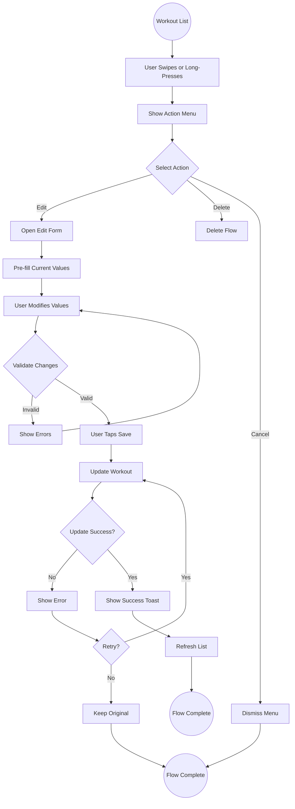

### 2.4 Delete Workout Flow

**Goal:** Remove a workout with confirmation  
**Entry Point:** Workout list item  
**Exit Point:** Deleted workout or cancel

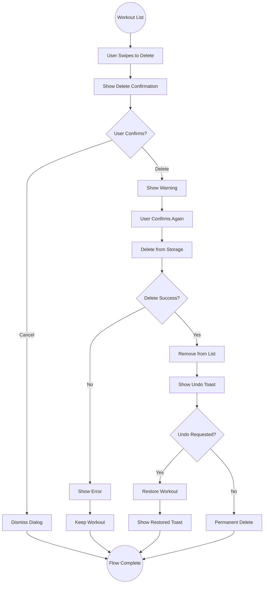

---

## Flow 3: Progress Review

### 3.1 View Statistics Flow

**Goal:** Review workout statistics and progress  
**Entry Point:** Tab bar or Home screen  
**Exit Point:** Stats screen

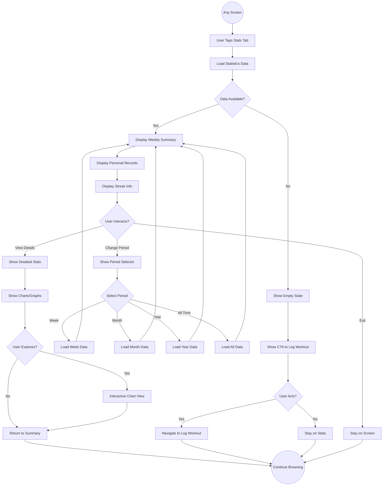

### 3.2 View Calendar Flow

**Goal:** Browse workout history by date  
**Entry Point:** Tab bar  
**Exit Point:** Calendar screen

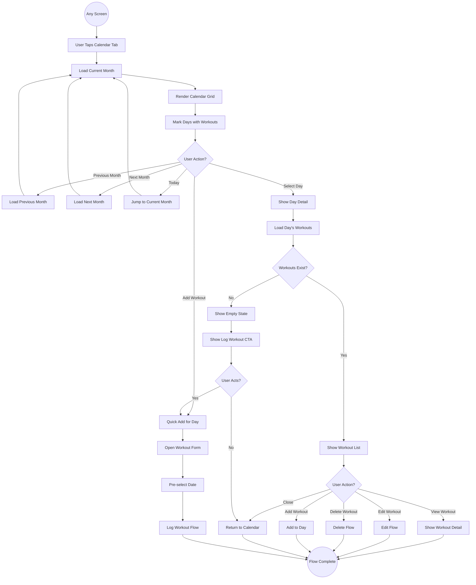

### 3.3 View Achievements Flow

**Goal:** Browse unlocked and locked achievements  
**Entry Point:** Tab bar  
**Exit Point:** Achievements screen

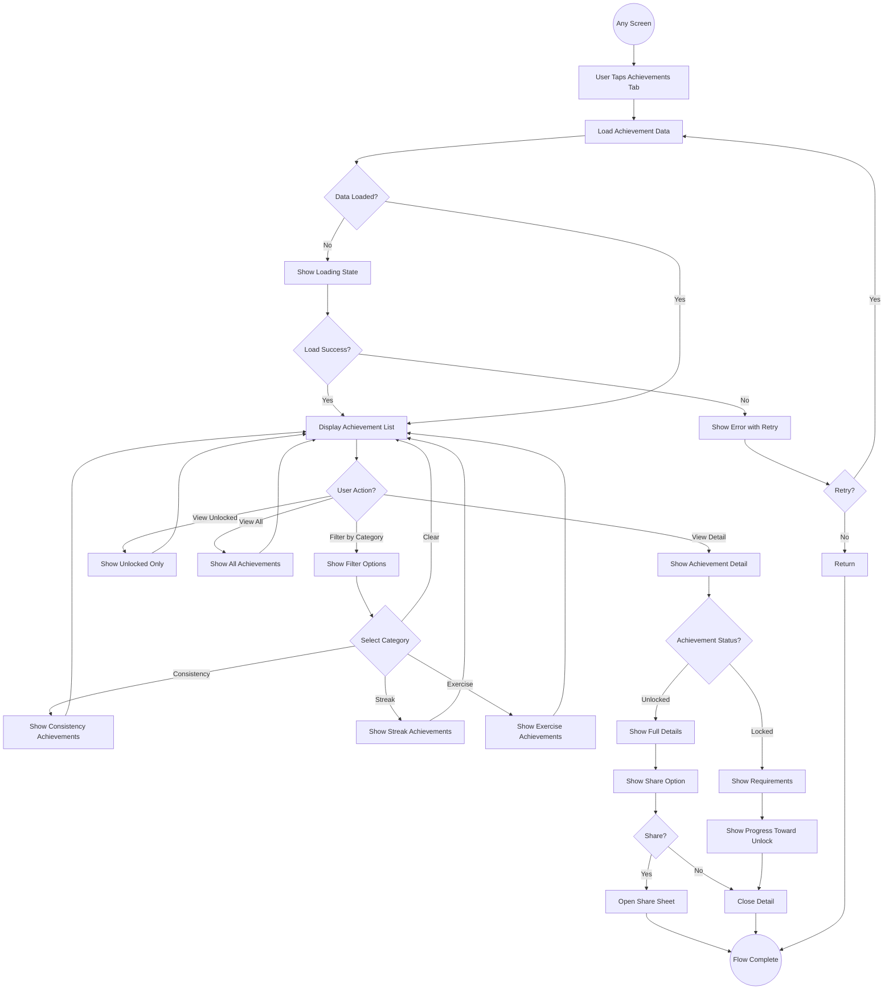

---

## Flow 4: Settings & Data Management

### 4.1 Settings Navigation Flow

**Goal:** Access and modify app settings  
**Entry Point:** Settings icon or Home screen  
**Exit Point:** Settings screen or return

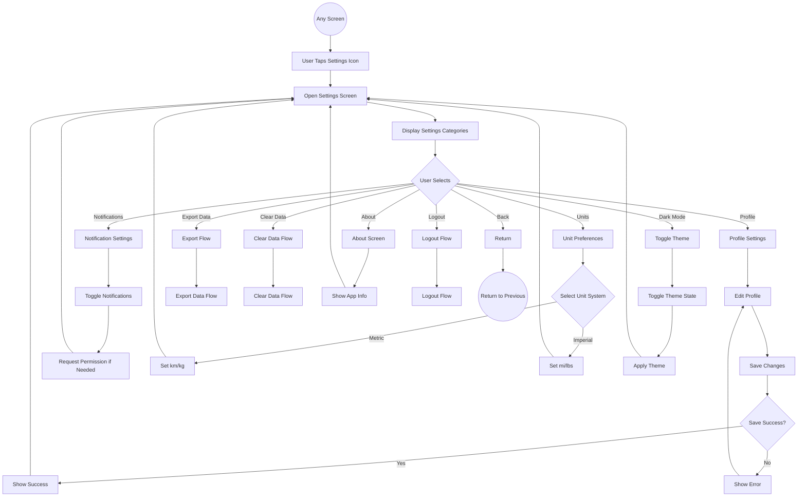

### 4.2 Data Export Flow

**Goal:** Export user workout data  
**Entry Point:** Settings > Export Data  
**Exit Point:** Export complete or cancel

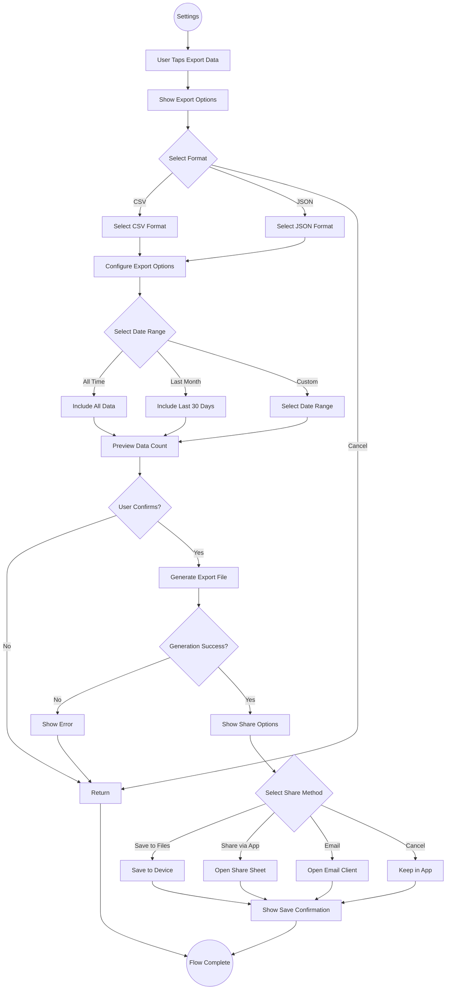

### 4.3 Logout Flow

**Goal:** Securely log out user  
**Entry Point:** Settings > Logout  
**Exit Point:** Login screen

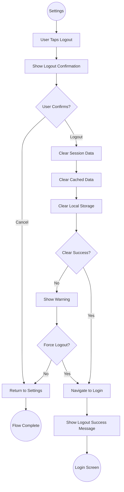

---

## Flow 5: Achievement System

### 5.1 Achievement Unlock Flow

**Goal:** Detect and celebrate achievement unlocks  
**Entry Point:** Workout save completion  
**Exit Point:** Achievement celebration or toast

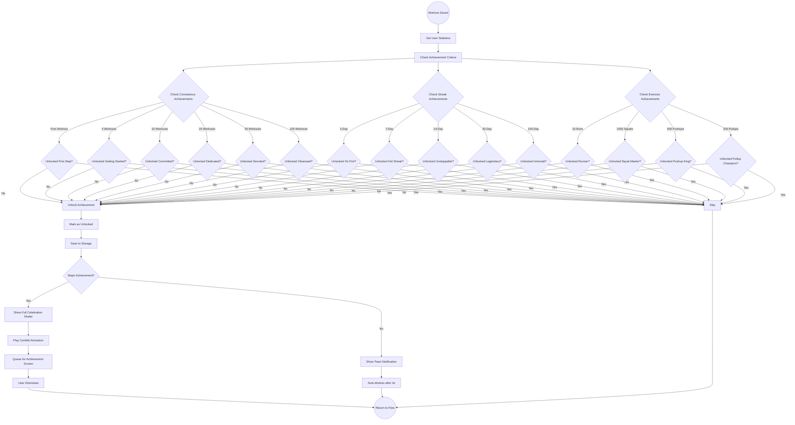

### 5.2 Personal Record Detection Flow

**Goal:** Detect and flag new personal records  
**Entry Point:** Workout save  
**Exit Point:** PR flag set or not

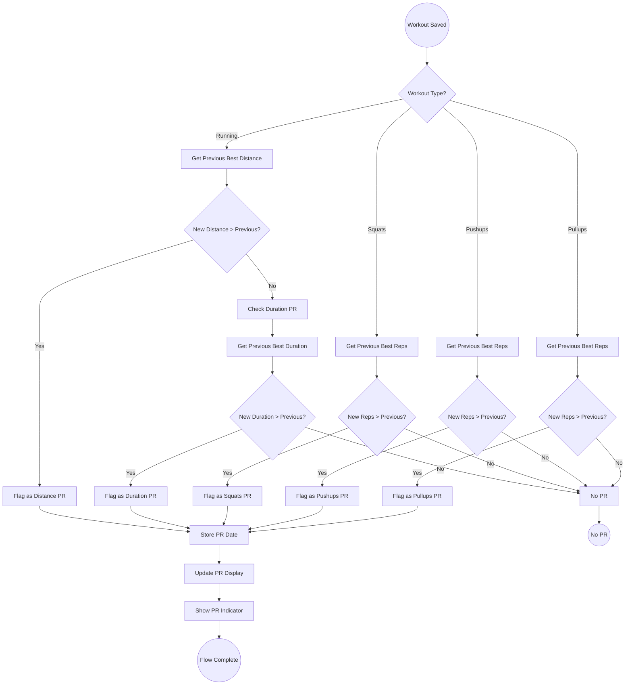

---

## Flow 6: Offline & Sync

### 6.1 Offline Workout Logging Flow

**Goal:** Log workouts while offline  
**Entry Point:** Home screen (offline state)  
**Exit Point:** Workout saved locally

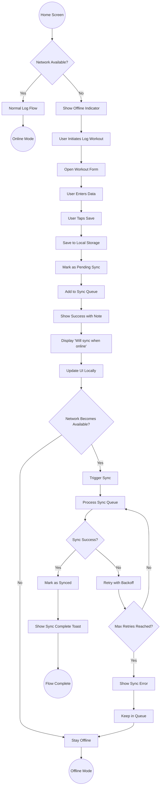

### 6.2 Sync Recovery Flow

**Goal:** Recover from sync failures  
**Entry Point:** Sync attempt failure  
**Exit Point:** Sync success or queued for retry

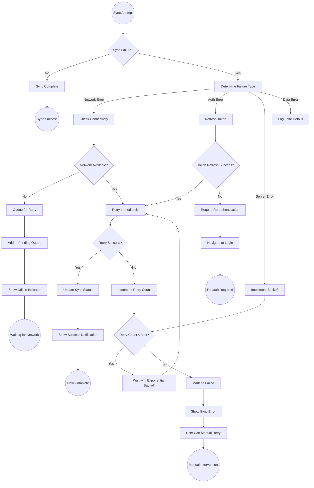

---

## Flow 7: Error Handling

### 7.1 General Error Recovery Flow

**Goal:** Handle and recover from errors gracefully  
**Entry Point:** Any error state  
**Exit Point:** Recovery or graceful degradation

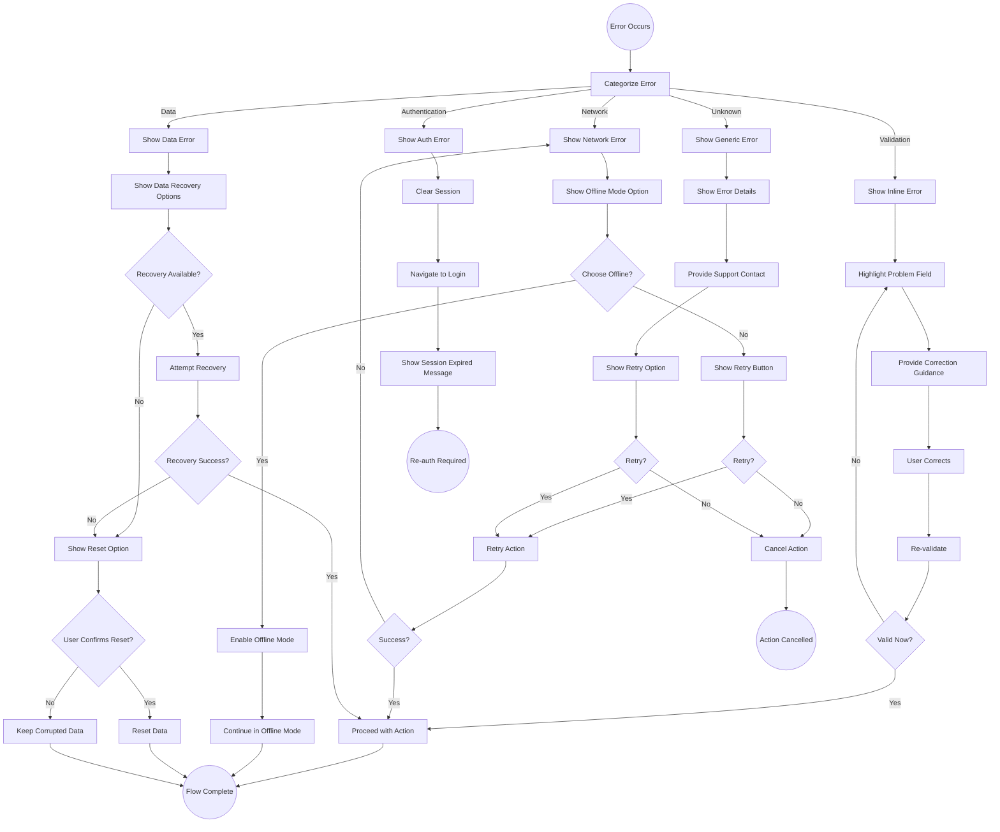

---

## Screen Transition Map

### Complete Navigation Graph

```
┌─────────────────────────────────────────────────────────────────┐
│                        APP NAVIGATION MAP                       │
└─────────────────────────────────────────────────────────────────┘

                              ┌─────────────┐
                              │   Splash    │
                              └──────┬──────┘
                                     │
                    ┌────────────────┼────────────────┐
                    │                │                │
              ┌─────▼─────┐   ┌─────▼─────┐   ┌─────▼─────┐
              │ Onboarding│   │   Login   │   │   Home    │
              └─────┬─────┘   └─────┬─────┘   └─────┬─────┘
                    │               │               │
                    │               │       ┌───────┼───────┐
                    │               │       │       │       │
                    │         ┌─────▼─────┐ │ ┌─────▼─────┐ │
                    │         │ Register  │ │ │  Workout  │ │
                    │         └───────────┘ │ │   Type    │ │
                    │                       │ └─────┬─────┘ │
                    │                       │       │       │
                    │                       │ ┌─────▼─────┐ │
                    │                       │ │  Running  │ │
                    │                       │ │   Form    │ │
                    │                       │ └─────┬─────┘ │
                    │                       │       │       │
                    │                       │ ┌─────▼─────┐ │
                    │                       │ │ Strength  │ │
                    │                       │ │   Form    │ │
                    │                       │ └─────┬─────┘ │
                    │                       │       │       │
                    │                       │ ┌─────▼─────┐ │
                    │                       │ │  Success  │ │
                    │                       │ └───────────┘ │
                    │                       │               │
                    │                       │    ┌──────────▼──────────┐
                    │                       │    │   Tab Navigation    │
                    │                       │    └──────────┬──────────┘
                    │                       │               │
                    │                       │    ┌──────────┼──────────┐
                    │                       │    │          │          │
                    │                       │ ┌──▼──┐  ┌───▼───┐  ┌───▼───┐
                    │                       │ │Home │  │Calendar│  │ Stats │
                    │                       │ └──┬──┘  └───┬───┘  └───┬───┘
                    │                       │    │        │        │
                    │                       │    │   ┌────▼────┐   │
                    │                       │    │   │Day Detail│   │
                    │                       │    │   └─────────┘   │
                    │                       │    │                 │
                    │                       │ ┌──▼─────────────────▼──┐
                    │                       │ │    Achievements       │
                    │                       │ └──────────┬────────────┘
                    │                       │            │
                    │                       │      ┌─────▼─────┐
                    │                       │      │  Unlock   │
                    │                       │      │   Modal   │
                    │                       │      └───────────┘
                    │                       │
                    │                       │ ┌─────────────────┐
                    │                       └─│    Settings     │
                    │                         └────────┬────────┘
                    │                                  │
                    │                         ┌────────┼────────┐
                    │                         │        │        │
                    │                    ┌────▼────┐ ┌─▼─┐ ┌────▼────┐
                    │                    │ Profile │ │...│ │  Logout │
                    │                    └─────────┘ └───┘ └─────────┘
                    │
              ┌─────▼─────┐
              │   Home    │
              └───────────┘
```

---

## Key Performance Metrics

### Flow Timing Targets

| Flow              | Target Time | Critical Path               |
| ----------------- | ----------- | --------------------------- |
| Quick Log Workout | <10 seconds | Home → Form → Save          |
| Full Log Workout  | <30 seconds | Home → Select → Form → Save |
| View Statistics   | <3 seconds  | Tab → Load → Display        |
| View Calendar     | <2 seconds  | Tab → Load → Display        |
| Login             | <5 seconds  | Enter → Submit → Home       |
| Register          | <30 seconds | Enter → Submit → Home       |
| Edit Workout      | <15 seconds | Select → Edit → Save        |
| Delete Workout    | <5 seconds  | Select → Confirm → Delete   |

### Tap Count Targets

| Flow           | Maximum Taps | Optimal Taps |
| -------------- | ------------ | ------------ |
| Quick Log      | 4            | 3            |
| Full Log       | 8            | 6            |
| View Stats     | 2            | 1            |
| View Calendar  | 2            | 1            |
| Login          | 3            | 2            |
| Register       | 6            | 5            |
| Edit Workout   | 5            | 4            |
| Delete Workout | 3            | 2            |

---

## Edge Cases & Error Scenarios

### Network-Related

| Scenario                  | User Impact    | Recovery                      |
| ------------------------- | -------------- | ----------------------------- |
| No network on launch      | Can't login    | Offline mode, cached session  |
| Network drops during sync | Data queued    | Auto-retry when reconnected   |
| Slow network              | Loading delays | Show skeletons, optimistic UI |
| Server error              | Action fails   | Retry with backoff            |

### Data-Related

| Scenario              | User Impact   | Recovery                    |
| --------------------- | ------------- | --------------------------- |
| Corrupted local data  | App crash     | Reset option, cloud restore |
| Sync conflict         | Data mismatch | Last-write-wins with merge  |
| Storage full          | Can't save    | Cleanup suggestions         |
| Invalid import format | Import fails  | Specific error message      |

### User Error

| Scenario           | User Impact    | Recovery                     |
| ------------------ | -------------- | ---------------------------- |
| Wrong credentials  | Can't login    | Clear error, forgot password |
| Invalid form input | Can't submit   | Inline validation            |
| Accidental delete  | Data loss      | Undo toast (5 seconds)       |
| Wrong workout type | Incorrect data | Easy edit flow               |

---

_This user flow documentation should be referenced during implementation to ensure all paths are covered. Any changes to flows must be documented and approved._

**Last Updated:** March 15, 2026  
**Next Review:** After MVP development complete
