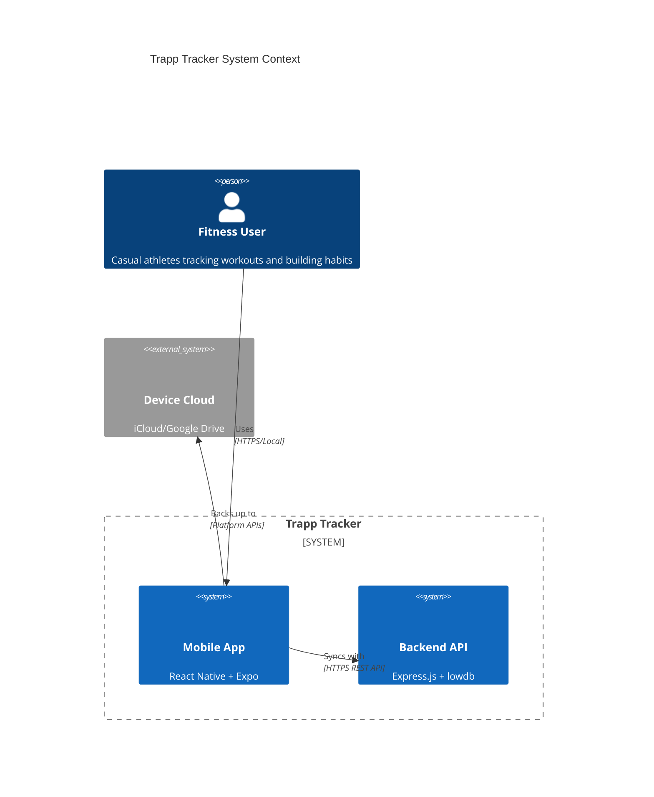
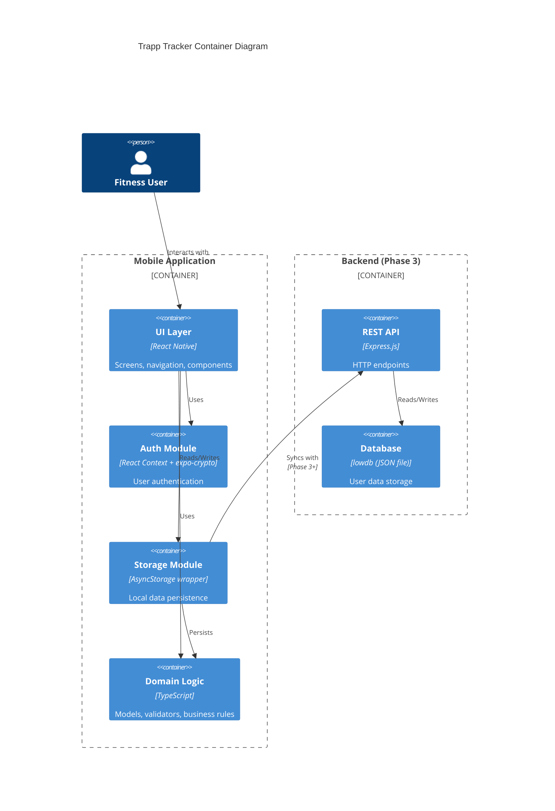
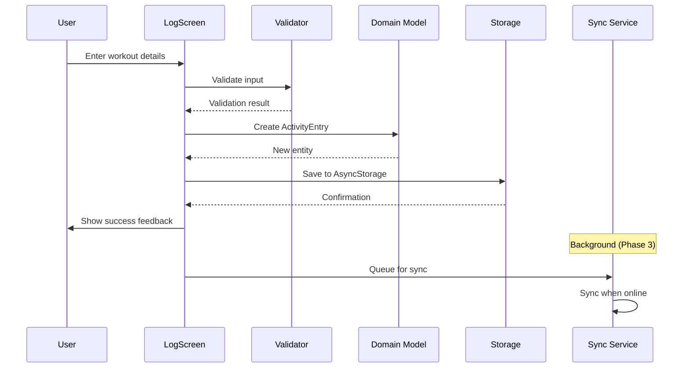
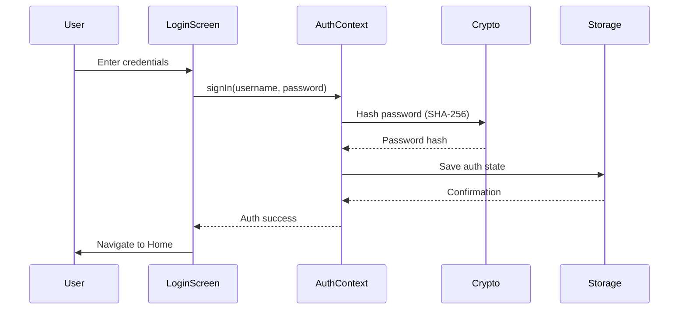
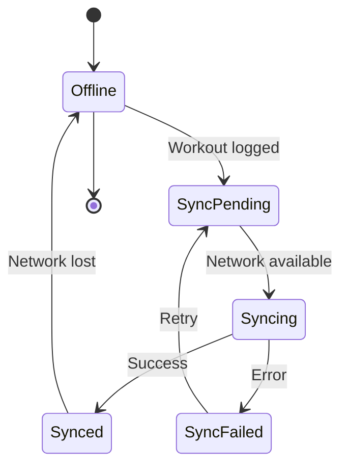

# Trapp Tracker - System Architecture

**Version:** 1.0  
**Last Updated:** 2026-03-15  
**Status:** Approved for MVP Development

---

## 1. Executive Summary

Trapp Tracker is a cross-platform fitness tracking application built with React Native and Expo. The architecture follows an **offline-first modular monolith** pattern, prioritizing simplicity for the MVP while establishing clear boundaries for future evolution toward cloud-sync capabilities.

### Architectural Vision

> "A simple, maintainable architecture that empowers users to build unbreakable fitness habits through frictionless tracking."

---

## 2. High-Level Architecture

### 2.1 System Context Diagram (C4 Level 1)



### 2.2 Container Diagram (C4 Level 2)



### 2.3 Architecture Style

**Pattern:** Modular Monolith (Offline-First)

| Characteristic         | Decision                        | Rationale                                            |
| ---------------------- | ------------------------------- | ---------------------------------------------------- |
| **Architecture Style** | Modular Monolith                | Small team, single codebase, clear module boundaries |
| **Deployment Model**   | Mobile-first, backend optional  | MVP works offline; backend added in Phase 3          |
| **Data Flow**          | Unidirectional (React patterns) | Predictable state updates, easier debugging          |
| **Sync Strategy**      | Optimistic local-first          | Immediate UX, background sync when online            |

---

## 3. Component Architecture

### 3.1 Frontend Module Breakdown

```
src/
├── auth/                    # Authentication bounded context
│   ├── AuthContext.tsx      # React Context for auth state
│   └── validators.ts        # Password/email validation
│
├── components/              # Shared UI components
│   ├── Button.tsx
│   ├── Input.tsx
│   ├── WorkoutCard.tsx
│   └── AchievementBadge.tsx
│
├── screens/                 # Screen components (UI + business logic)
│   ├── SplashScreen.tsx
│   ├── LoginScreen.tsx
│   ├── HomeScreen.tsx
│   ├── LogScreen.tsx
│   ├── CalendarScreen.tsx
│   ├── AchievementsScreen.tsx
│   └── SettingsScreen.tsx
│
├── navigation/              # Navigation configuration
│   └── types.ts             # TypeScript navigation types
│
├── domain/                  # Domain models and logic (proposed)
│   ├── models.ts            # Core entities (ActivityEntry, AppState)
│   ├── validators.ts        # Business rule validators
│   └── achievements.ts      # Achievement criteria engine
│
├── storage/                 # Data persistence layer
│   ├── storage.ts           # AsyncStorage wrappers
│   └── migrations.ts        # Schema migration utilities
│
└── services/                # External service integrations (proposed)
    ├── sync.ts              # Cloud sync service
    └── export.ts            # Data export service
```

### 3.2 Module Responsibilities

| Module         | Responsibility                          | Dependencies                              |
| -------------- | --------------------------------------- | ----------------------------------------- |
| **auth**       | User authentication, session management | expo-crypto, AsyncStorage                 |
| **components** | Reusable UI primitives                  | React Native, expo-vector-icons           |
| **screens**    | Screen-level UI and user interactions   | All lower modules                         |
| **navigation** | App routing and tab configuration       | @react-navigation/\*                      |
| **domain**     | Business logic, models, validators      | None (pure TypeScript)                    |
| **storage**    | Local data persistence, migrations      | @react-native-async-storage/async-storage |
| **services**   | External integrations (sync, export)    | domain, storage, fetch API                |

### 3.3 Dependency Direction

```
┌─────────────────────────────────────────────────────────┐
│                      Screens                            │
│                         ↑                               │
│                         │ uses                          │
│                         ↓                               │
│         ┌───────────────┼───────────────┐               │
│         │               │               │               │
│    Components       Navigation       Domain             │
│         ↑               ↑               ↑               │
│         │               │               │               │
│         └───────────────┼───────────────┘               │
│                         │                               │
│                         ↓                               │
│                      Storage                            │
│                         ↑                               │
│                         │                               │
│                      Services                           │
└─────────────────────────────────────────────────────────┘

Rule: Dependencies point inward. Higher layers depend on lower layers.
      Domain and Storage have no dependencies on UI layers.
```

---

## 4. Data Flow

### 4.1 Workout Logging Flow



### 4.2 Authentication Flow



### 4.3 Data Sync Flow (Phase 3)



---

## 5. Technology Stack

### 5.1 Core Technologies

| Layer                    | Technology       | Version | Justification                                               |
| ------------------------ | ---------------- | ------- | ----------------------------------------------------------- |
| **Mobile Framework**     | React Native     | 0.81.5  | Cross-platform, large ecosystem, team familiarity           |
| **Development Platform** | Expo             | ~55.0.6 | Managed workflow, OTA updates, simplified native deps       |
| **Language**             | TypeScript       | ~5.9.2  | Type safety, better IDE support, fewer runtime errors       |
| **Navigation**           | React Navigation | ^6.6.1  | Community standard, well-maintained, TypeScript support     |
| **Local Storage**        | AsyncStorage     | 2.2.0   | Simple key-value, React Native standard, sufficient for MVP |
| **Cryptography**         | expo-crypto      | ~15.0.8 | Secure hashing, Expo-managed, no native linking             |
| **Testing**              | Jest + jest-expo | ^29.6.0 | React Native testing standard, snapshot support             |
| **Backend (Phase 3)**    | Express.js       | ^4.18.4 | Lightweight, simple, sufficient for sync use case           |
| **Backend DB (Phase 3)** | lowdb            | ^5.0.0  | JSON file storage, zero config, easy prototyping            |

### 5.2 Technology Selection Rationale

#### Why React Native + Expo?

- **Cross-platform efficiency**: Single codebase for iOS and Android (US-6.1, US-7.1)
- **Rapid iteration**: Fast refresh, OTA updates for bug fixes
- **Managed native modules**: expo-crypto, AsyncStorage work out-of-box
- **Trade-off**: Limited native module access vs. bare React Native

#### Why AsyncStorage?

- **Simplicity**: No schema management, straightforward API
- **Sufficient for MVP**: User data volume < 10MB for foreseeable future
- **Expo compatibility**: Works in managed workflow
- **Trade-off**: No complex queries, limited to ~6MB on some Android devices

#### Why Context API for State?

- **Built-in**: No additional dependencies
- **Sufficient scale**: < 10 global state slices for MVP
- **Trade-off**: Can cause re-renders; consider Zustand/Jotai if performance issues arise

#### Why Express.js + lowdb?

- **Minimal complexity**: Single file deployment, no database setup
- **Phase 3 appropriate**: Start simple, migrate to PostgreSQL if needed
- **Trade-off**: Not suitable for high concurrency; plan migration at 1000+ concurrent users

---

## 6. Quality Attribute Support

### 6.1 Performance

- **Workout logging < 10 seconds**: AsyncStorage writes are async and local
- **Fast app launch**: Lazy loading of screens, minimal initial data fetch
- **Smooth scrolling**: FlatList with windowing for workout history

### 6.2 Security

- **Password hashing**: SHA-256 via expo-crypto (client-side for MVP)
- **Session persistence**: Encrypted AsyncStorage (consider expo-secure-store Phase 2)
- **Input validation**: Client-side validation before storage

### 6.3 Modifiability

- **Module boundaries**: Clear separation between auth, storage, domain, UI
- **TypeScript interfaces**: Contract-first development
- **Dependency injection**: Context API for swappable implementations

### 6.4 Availability

- **Offline-first**: All core features work without network
- **Graceful degradation**: Sync queue for when network unavailable
- **Error boundaries**: React error boundaries prevent full app crashes

---

## 7. Integration Points

### 7.1 Current Integrations

| Integration          | Purpose                  | Status      |
| -------------------- | ------------------------ | ----------- |
| **AsyncStorage**     | Local data persistence   | Implemented |
| **expo-crypto**      | Password hashing         | Implemented |
| **React Navigation** | App navigation           | Implemented |
| **expo-status-bar**  | Status bar customization | Implemented |

### 7.2 Planned Integrations (Phase 2+)

| Integration                | Purpose                      | Phase   |
| -------------------------- | ---------------------------- | ------- |
| **expo-secure-store**      | Encrypted credential storage | Phase 2 |
| **expo-file-system**       | Data export to files         | Phase 2 |
| **expo-sharing**           | Share workout achievements   | Phase 2 |
| **Backend API**            | Cloud sync                   | Phase 3 |
| **expo-notifications**     | Workout reminders            | Phase 3 |
| **react-native-chart-kit** | Progress charts              | Phase 2 |

---

## 8. Folder Structure Conventions

```
trapp/
├── App.tsx                 # App entry point
├── package.json            # Dependencies and scripts
├── tsconfig.json           # TypeScript configuration
├── app.json               # Expo configuration
│
├── docs/                   # Documentation
│   ├── product-vision.md
│   ├── user-stories.md
│   ├── architecture.md     # This document
│   ├── asr.md
│   └── technical-decisions.md
│
├── src/                    # Source code
│   ├── auth/               # Authentication context
│   ├── components/         # Reusable UI components
│   ├── domain/             # Business logic and models
│   ├── navigation/         # Navigation configuration
│   ├── screens/            # Screen components
│   ├── services/           # External service integrations
│   ├── storage/            # Data persistence
│   └── theme.ts            # Design tokens
│
├── backend/                # Backend server (Phase 3)
│   ├── index.js            # Express server
│   ├── data.json           # Database file
│   └── __tests__/          # Backend tests
│
├── __tests__/              # Frontend tests
│   └── *.test.tsx
│
└── __mocks__/              # Test mocks
    └── *.ts
```

### Naming Conventions

| Artifact       | Convention                  | Example                        |
| -------------- | --------------------------- | ------------------------------ |
| **Components** | PascalCase                  | `WorkoutCard.tsx`              |
| **Screens**    | PascalCase + Screen suffix  | `LogScreen.tsx`                |
| **Contexts**   | PascalCase + Context suffix | `AuthContext.tsx`              |
| **Models**     | PascalCase, camelCase file  | `ActivityEntry` in `models.ts` |
| **Utils**      | camelCase                   | `validators.ts`                |
| **Tests**      | `*.test.ts` or `*.test.tsx` | `AuthContext.test.tsx`         |

---

## 9. Evolution Strategy

### 9.1 Phase Progression

```
Phase 1 (MVP)          Phase 2 (Enhancement)      Phase 3 (Sync & Scale)
────────────           ─────────────────────        ────────────────────
• Local storage        • Data export               • Cloud sync
• Basic auth           • Charts & trends           • Backend API
• Core workout types   • Enhanced achievements     • Multi-device sync
• Simple stats         • Biometric auth            • Conflict resolution
                       • Push notifications        • User management
```

### 9.2 Evolution Triggers

| Trigger                         | Action                     | Target Phase |
| ------------------------------- | -------------------------- | ------------ |
| Users request data backup       | Implement export           | Phase 2      |
| Performance issues with Context | Migrate to Zustand         | Phase 2      |
| Multi-device usage reported     | Enable backend sync        | Phase 3      |
| AsyncStorage limits hit         | Migrate to SQLite          | Phase 3      |
| 1000+ concurrent users          | Migrate lowdb → PostgreSQL | Phase 3      |

### 9.3 Architectural Runway

The following provisions enable future evolution without rewrites:

1. **Service layer abstraction**: `storage.ts` can swap AsyncStorage for SQLite
2. **Domain model purity**: `models.ts` has no UI dependencies
3. **Auth context interface**: Can integrate with backend auth without UI changes
4. **Sync-ready data model**: `ActivityEntry` includes `createdAt`/`updatedAt` for sync

---

## 10. Architecture Compliance

### 10.1 Review Checklist

Before merging significant changes, verify:

- [ ] New modules respect dependency direction (no circular deps)
- [ ] Domain models remain pure (no React/React Native imports)
- [ ] Storage operations are async and error-handled
- [ ] Screens use Context API, not direct storage calls
- [ ] New features align with bounded contexts

### 10.2 Technical Debt Tracking

Track architectural debt in `docs/technical-debt.md`:

| Debt                       | Impact            | Remediation            | Target Phase |
| -------------------------- | ----------------- | ---------------------- | ------------ |
| SHA-256 client hashing     | Security risk     | Move to backend bcrypt | Phase 3      |
| No data encryption at rest | Privacy concern   | Add expo-secure-store  | Phase 2      |
| lowdb single-file DB       | Concurrency limit | Migrate to PostgreSQL  | Phase 3      |

---

## 11. References

- [Product Vision](../reqs/product-vision.md)
- [User Stories](../reqs/user-stories.md)
- [Feature Specifications](../reqs/features.md)
- [Development Roadmap](../reqs/roadmap.md)
- [Architecture Decision Records](../tech/technical-decisions.md)
- [Architecture Significant Requirements](../tech/asr.md)

---

_This document should be reviewed quarterly and updated as the architecture evolves._
